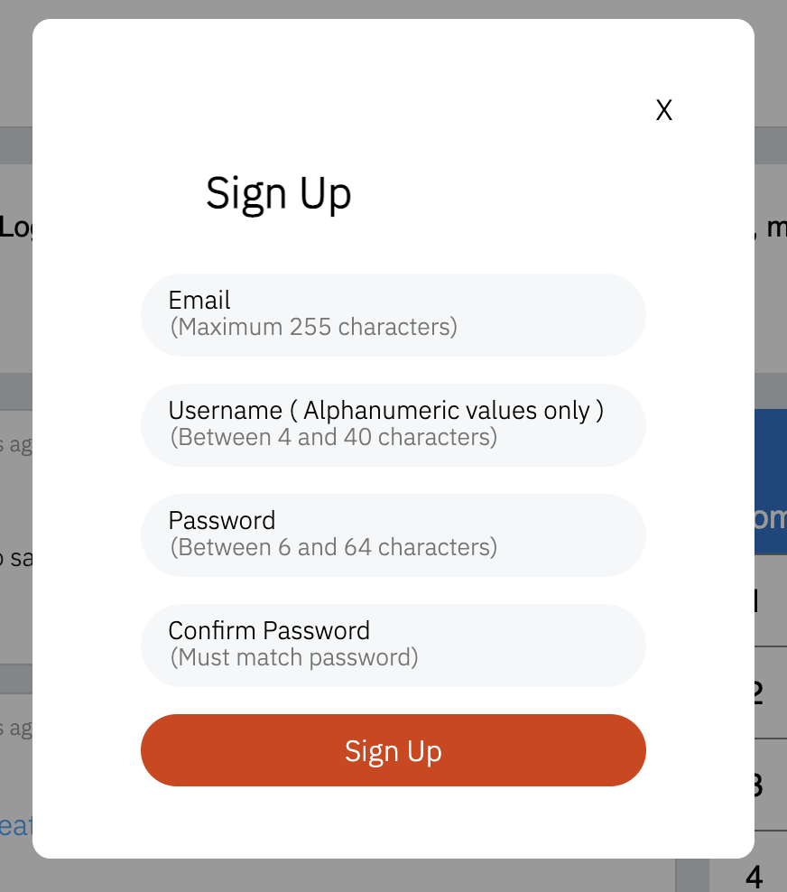

# Teddir

## Wiki Links

### [Database Schema](https://github.com/yonilurie/reddit-clone/wiki/Database-Schema)

### [Feature List](https://github.com/yonilurie/reddit-clone/wiki/Feature-List)

### [User Stories](https://github.com/yonilurie/reddit-clone/wiki/User-Stories)

### [WireFrame](https://github.com/yonilurie/reddit-clone/wiki/WireFrame)

## Description

This application is a clone of [Reddit.com](https://www.reddit.com/).
Users will be able to create subreddits, make posts, and upvote or downvote content

## Heroku Live Link

[Teddir Live Link](https://teddir.herokuapp.com/)

## Technologies used

  

 

## MVP Features - Full CRUD

-   Subreddits
-   Posts
-   Upvoting and downvoting posts

## Screenshots

### Home page while logged out

### Sign up modal

### Logged in Navbar Profile menu

### User profile

### User submit page with image uploaded

### Subreddit page

### Mod tools for editing subreddit

